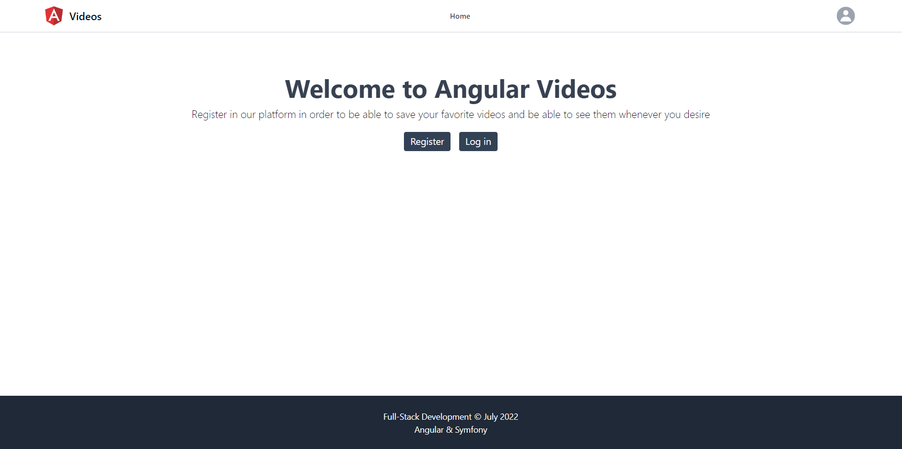
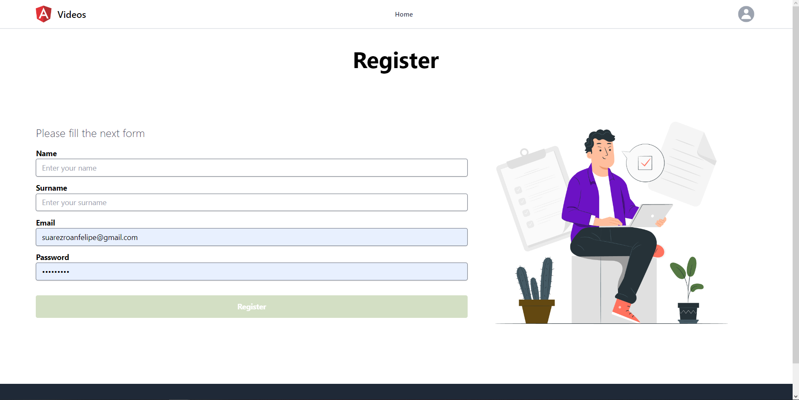
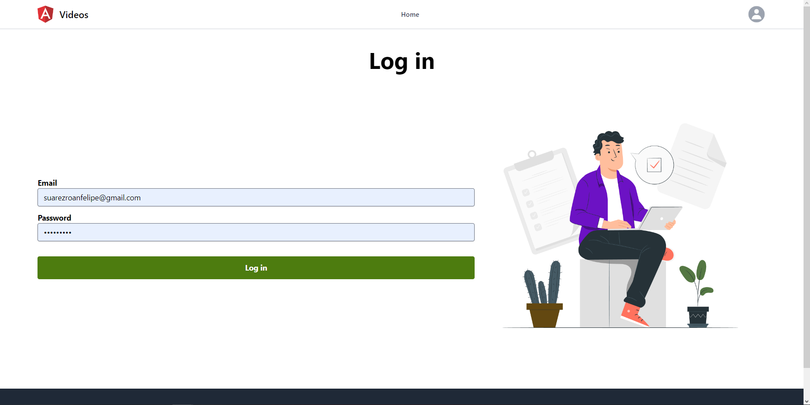
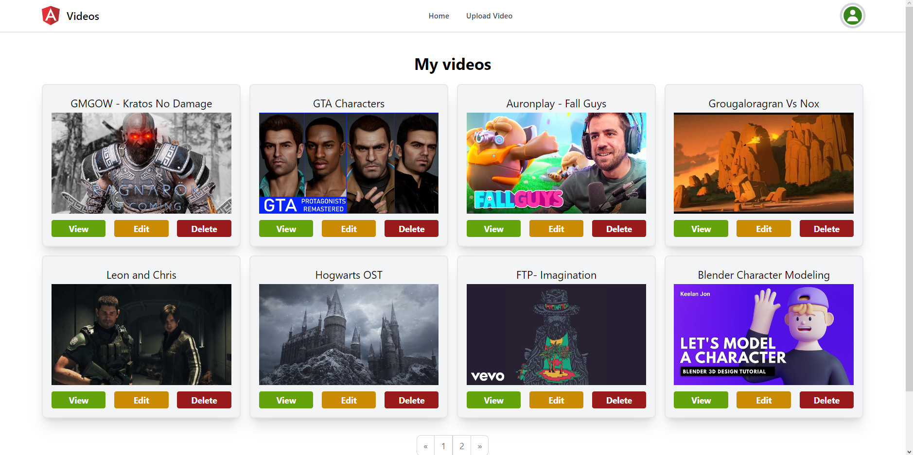
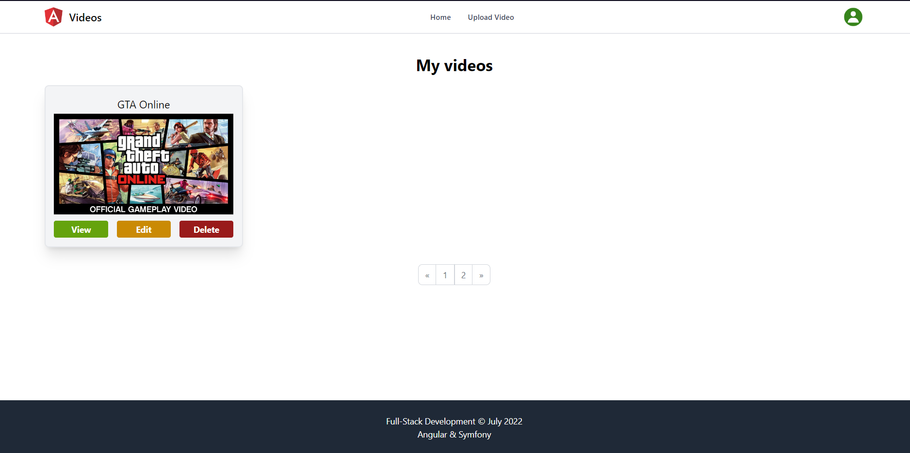
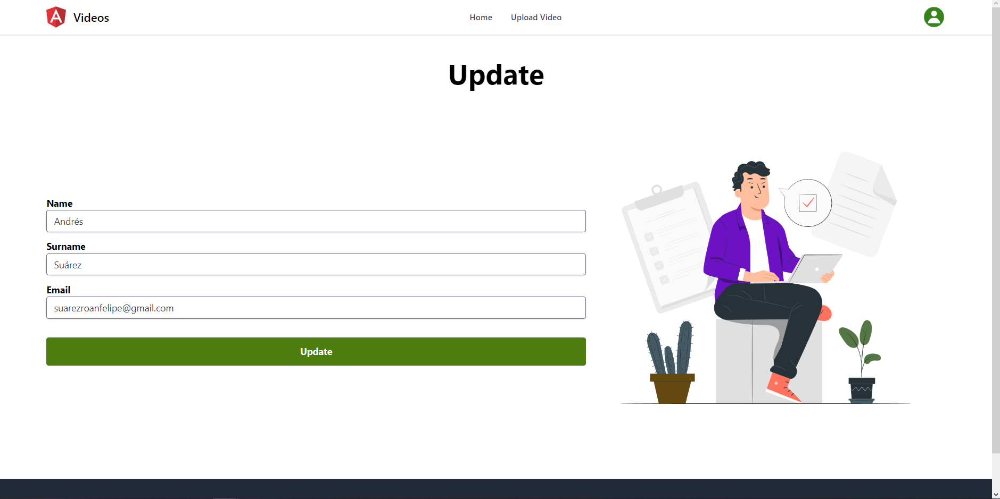
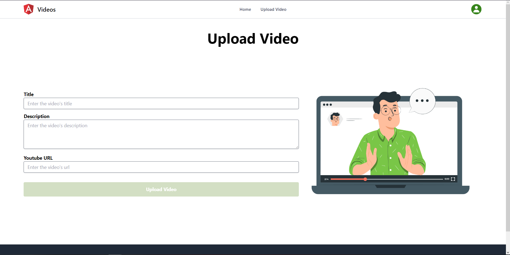
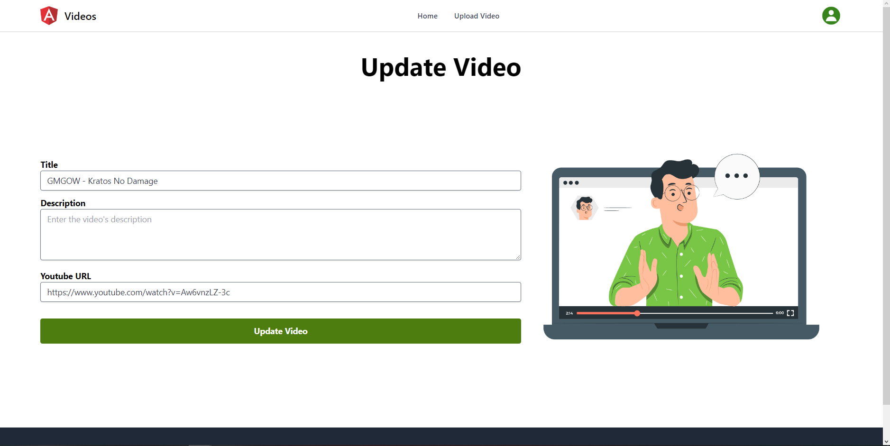
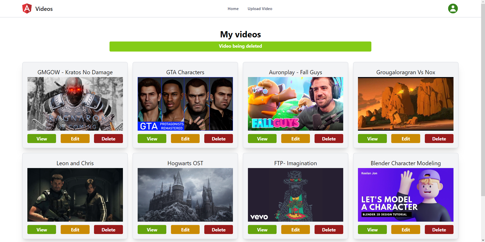

# Videos-Angular
This application was developed with Angular and Symfony Frameworks, its functionality is a CRUD. Node version 18.4.0.

### Functionality
- Register new users
- Log in / Log out
- Update data from user
- Create new registry about a youtube video (Title, Description, URL)
- Update the registry of the selected video
- Visualize videos stored in the home page
- DB stored in Apache Web Server provided by XAMPP

## Installation
To install this project follow the next steps:
1.  Download the repository found here: [Videos-Angular](https://github.com/SuaferoanTJK/Videos-Angular).
2.  Store the folder inside the XAMPP folder.
3.  Start the Apache and MySQL modules in the XAMPP.
4.  Use the file "database.sql" to create the database in phpMyAdmin.
5.  Start a terminal inside the folder "blog-angular".
6.  Run **npm install** script.
7.  Run **ng serve** script.
8.  Go to http://localhost:4200

## Screenshots

  
  
  
  
  
  
  
  
  

## Get in touch
### LinkedIn
https://www.linkedin.com/in/andrés-f-suárez/
